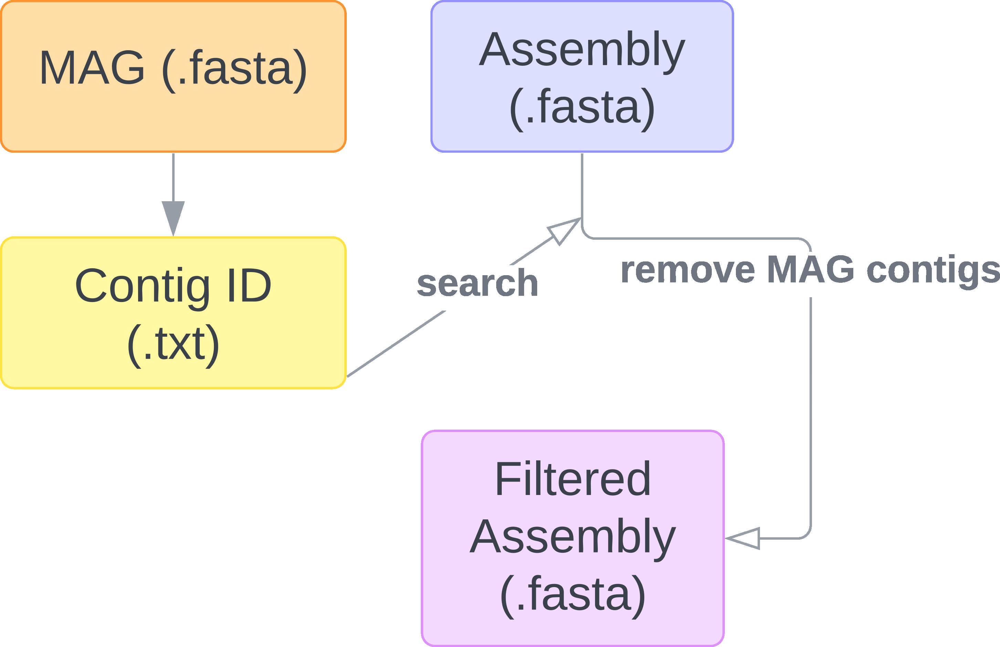
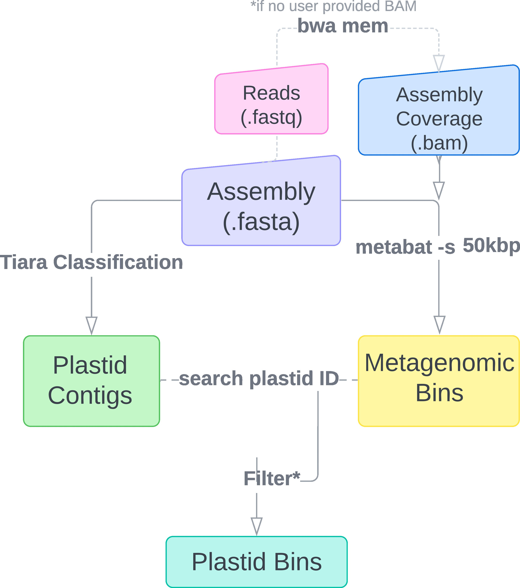
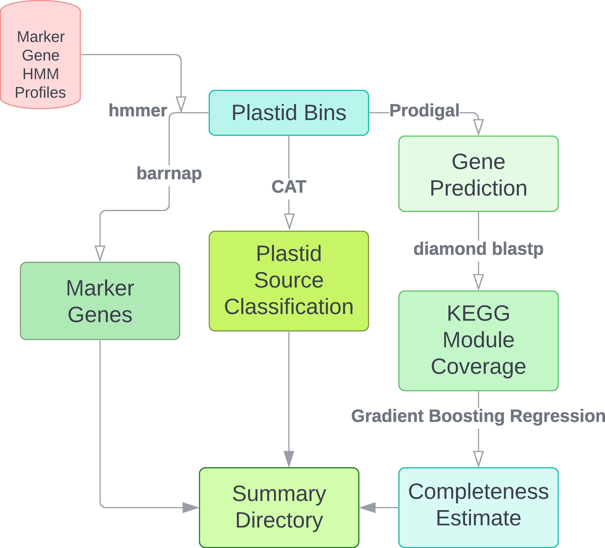
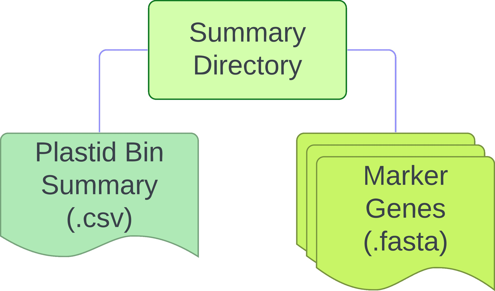

# plastiC
A [Snakemake](https://snakemake.readthedocs.io/en/stable/getting_started/installation.html) workflow for recovery and characterization of plastid genomes from metagenomic datasets. *plastiC* leverages existing metagenomic tools to identify and characterize plastid genomes starting from metagenomic assemblies. 

If you use this tool, please [cite](https://doi.org/10.12688/wellcomeopenres.19589.1):  
Cameron, E.S., Blaxter, M.L., Finn, R.D. plastiC: A pipeline for recovery and characterization of plastid genomes from metagenomic datasets [version 1; peer review: 1 approved, 1 approved with reservations]. Wellcome Open Res 2023, 8:475 (https://doi.org/10.12688/wellcomeopenres.19589.1)

# How it works...
*plastiC* requires the following input files: 
## Required Input
1. Metagenomic assembly (.fasta) - generated from preferred metagenomic assembly tool (e.g., SPAdes). 
Assemblies are used to screen for potential plastid sequences. 
Each sample being analyzed should have it's own folder containing the final assembly file with a shared name. 
Example of file structure for metagenomic assembly input:
```
example
├── sample_1
│   └── scaffolds.fasta
├── sample_2
│   └── scaffolds.fasta
├── sample_3
│   └── scaffolds.fasta
├── sample_4
│   └── scaffolds.fasta
└── sample_5
    └── scaffolds.fasta
```

2. Metagenomic reads (.fastq) or assembly coverage (.bam) - if available, users can provide an assembly coverage file (.bam) generated from mapping. Alternatively, this coverage file can be generated in the pipeline by providing the metagenomic reads (.fastq). Coverage information is required for generating potential plastid bins. 

## Recommended Input
1. MAGs (.fasta) - if metagenomic analyses have been conducted on the assembly and high-quality metagenomic assembled genomes (MAGs) for other microbial taxa is available, these can be provided to remove sequences associated with high-quality and high-completeness microbial genomes. 

## Data preparation 
If provided, *plastiC* initiates by searching metagenomic assemblies for sequence identifiers corresponding to user provided MAG fasta files in the metagenomic assembly. This results in the generation of a filtered assembly fasta file which excludes all sequences which have been previously identified in high-quality MAGs. Filtered assemblies would then be used in the pipeline. 



If no MAGs are provided, *plastiC* will execute on the provided metagenomic assembly fasta file. 

## Generation of plastid bins
Generation of plastid bins requires assembly coverage information. Users may opt to either provide an assembly coverage file (.bam) and skip the mapping step, or to provide paths to read files for *plastiC* to generate coverage information. Using the coverage information, metagenomic bins are generated from the assembly file using metabat with a lower bin threshold size of 50kbp to account for the small plastid genome size. Concurrently, Tiara is used to identify potential plastid contigs in the assembly. 

Sequence identifiers of flagged plastid contigs are used to to search for metagenomic bins containing plastid signals. Plastid bins are selected based on the  percentage of the bin coming from plastid sequence. By default this threshold is set to 90% but users can adjust this threshold to their requirements in the config.yaml. 




## Plastid bin characterization
Following generation of plastid bins, *plastiC* will perform additional analyses to further summarize details of the recovered plastid genomes including taxonomic placement and a completeness estimate. The final completeness estimate of the recovered plastid genomes is reference independent. Users may opt to further explore the plastid genome quality by mapping to reference genomes arising from the same lineage. 




## Final output  
For each sample, three dictories will be created: `logs`, `working` and `plastids`. Final outputs regarding
plastid information can be found in the `plastids` directory. The `working` directory contains intermediate files
from analyses required for identification and characterziation of plastid genomes but can be removed if users desire.   



# Installation & Setup
plastiC is a Snakemake workflow and to run requires a Snakemake installation (https://snakemake.readthedocs.io/en/stable/getting_started/installation.html). Snakemake can be easily installed using conda as highlighted below. If not already installed, install [conda](https://conda.io/projects/conda/en/latest/user-guide/install/index.html).  

Following [conda] installation, Snakemake can be installed into a new environment.
1. Create a new environment with [Snakemake](https://snakemake.readthedocs.io/en/stable/getting_started/installation.html).  
Example:  
`conda create -n snakemake -c bioconda snakemake`

To have access to the workflow, clone the *plastiC* repository.
2. Clone *plastiC* repository.  
Example:  
`git clone --recursive https://github.com/escamero/plastiC.git`
  
3. Download databases (described below).

The *plastiC* workflow uses dockerhub to fetch all required tools, so ensure [Singularity](https://docs.sylabs.io/guides/3.0/user-guide/installation.html) is also installed.

# Databases
*plastiC* requires databases for taxonomic source classification using [CAT](https://github.com/dutilh/CAT) and for completeness estimation.  
Please download the following and provide links to the paths to these databases in the as instructed `config.yml`. 

**CAT Databases**  
Please visit https://github.com/dutilh/CAT for database installation and preparation instructions provided. 

**Uniref**  
For completeness estimation, gradient boosting regression models were trained on a *diamond* database created from the Uniref100 (released November 26, 2018) database with KO annotations as used in [*CheckM2*](https://www.biorxiv.org/content/10.1101/2022.07.11.499243v1).  

Currently, the workflow can be run using the *diamond* database created by [*CheckM2*](https://github.com/chklovski/CheckM2) developers available to download [here](https://zenodo.org/record/5571251#.Y6bB2i-l1-U).  

An updated database for completeness estimates will be hosted and released in the future. 

# Configuration
Please fill in the *config.yaml* with file and directory paths as described in the file. 

# Running the workflow
After the above steps have been completed, samples can now be run to identify plastid genomes. The first step is to activate your Snakemake `conda` environment that was created during setup.  
Example:  
`conda activate snakemake`  

The value for `-j` should be adjusted to reflect the number of cores available. The `-k` flag may be removed if users desire the workflow to stop if an independent job fails. The `--use-singularity` flag is required for as tools and dependencies for rules are in a docker container. 

Example:  
`snakemake --use-singularity -k -j 2`

*plastiC* can also be executed on a cluster. The specifications (e.g., memory, cores) for cluster execution can be adjusted in the `cluster.yml` file.  
Note: Exact submission command may need to bea djusted depending on your system.  
Example:  
`snakemake --use-singularity -k -j 2 --cluster-config cluster.yml --cluster 'bsub -n {cluster.nCPU} -M {cluster.mem} -o {cluster.output}'`
